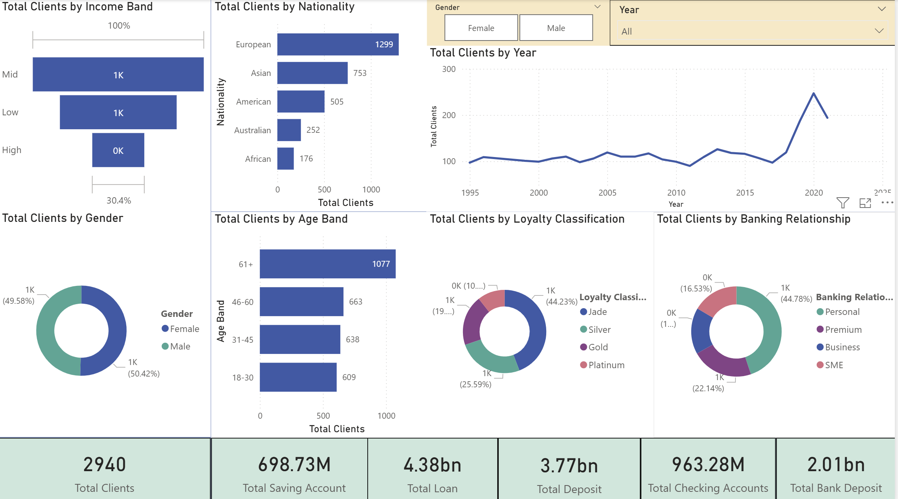
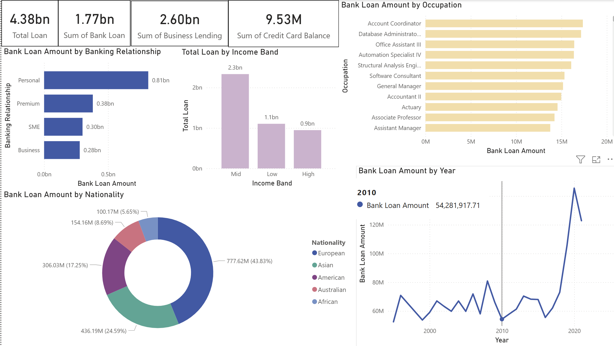
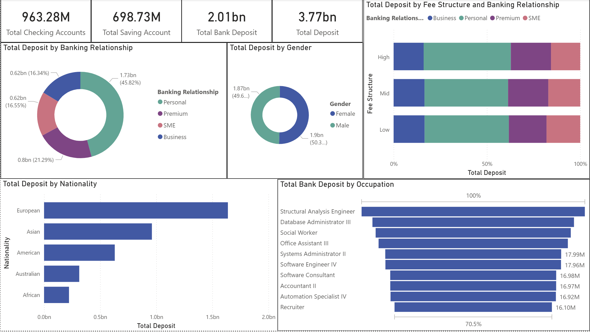
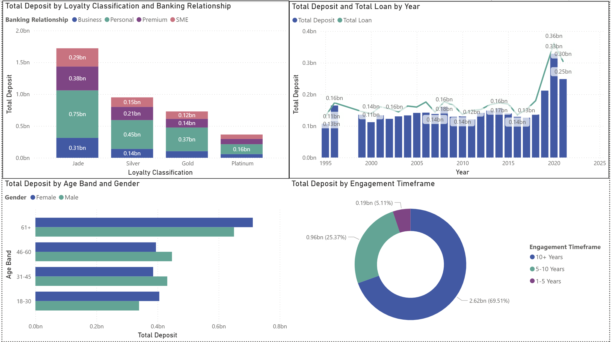
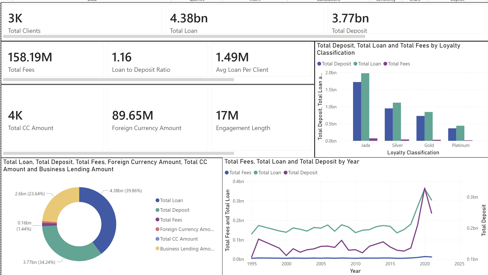
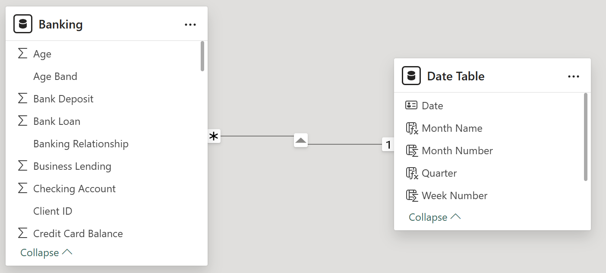

# 🏦 Banking Portfolio Analytics


## Project Overview

This project analyses a banking portfolio containing **3,000 clients** using **MySQL, Python and Power BI**.

The aim was to understand the portfolio from three connected perspectives:

- 📉 **Risk screening**
- 📈 **Client growth**
- 💰 **Fee generation**

The project does not attempt to predict default.

Instead, it uses the available customer, lending, deposit and income data to identify **portfolio concentrations and client groups that may deserve closer review**.

The workflow was:

```text
Banking.csv
     ↓
MySQL Analysis
     ↓
Python EDA
     ↓
Power BI
     ↓
Risk · Growth · Fee Analysis
```

---

# 🎯 Business Questions

The analysis focused on several practical questions:

- Which client groups hold the largest lending exposure?
- How are loans and deposits distributed across the portfolio?
- Which clients have relatively large lending balances?
- Which clients have bank loan balances above their bank deposits?
- Which customer groups are contributing most to client acquisition?
- How do income, banking relationship and loyalty differ across clients?
- Which client groups generate the largest estimated fee amounts?
- Which financial variables move together?
- How can risk, client growth and fee generation be viewed together?

---

# 📊 Dataset

| Attribute | Value |
|---|---:|
| Clients | **3,000** |
| Raw Columns | **25** |
| Missing Values | **0** |
| Joining Date Range | **1995–2021** |
| Age Range | **17–85** |
| Unique Occupations | **195** |

The dataset contains client demographics, lending balances, deposits, income, banking relationships, loyalty classifications and other banking variables.

---

## Main Source Fields

| Area | Fields |
|---|---|
| Client | Client ID, Name, Age, Joined Bank |
| Demographics | Nationality, Gender ID, Occupation |
| Relationship | BRId, Loyalty Classification, Banking Contact |
| Income | Estimated Income, Superannuation Savings |
| Lending | Bank Loans, Business Lending, Credit Card Balance |
| Deposits | Bank Deposits, Checking Accounts, Saving Accounts, Foreign Currency Account |
| Other | Fee Structure, Properties Owned, Risk Weighting, IAId, Location ID |

---

# 🛠️ Project Architecture

```text
┌───────────────────────────────────────┐
│             Banking.csv               │
│       3,000 Clients · 25 Fields       │
└───────────────────┬───────────────────┘
                    │
          ┌─────────┼─────────┐
          │         │         │
          ▼         ▼         ▼
       MySQL      Python   Power BI
          │         │         │
     Validation     EDA     Reporting
     Segments    Correlation   DAX
     Risk Rules  Distributions KPIs
     Fees        Relationships 9 Pages
          │         │         │
          └─────────┴─────────┘
                    │
                    ▼
        Risk · Growth · Fee Analysis
```

---

# 🗄️ MySQL Analysis

The SQL component performs the main structured portfolio analysis.

**File:**

```text
sql/Banking_Complete_SQL_analysis.sql
```

The script covers:

1. Database and table setup
2. Data quality checks
3. Feature engineering
4. Client segmentation
5. Loan analysis
6. Deposit analysis
7. Portfolio screening indicators
8. Client acquisition and cohort analysis
9. Estimated fee analysis
10. Reusable SQL views
11. Executive portfolio summary

---

## Data Quality Checks

The SQL stage validates:

- row count
- missing values
- duplicate Client IDs
- categorical values
- numerical ranges
- joining-date range

The source contains **3,000 unique client records with no missing values**.

---

# 🧩 Feature Engineering

Several analytical fields were created from the raw data.

### Income Bands

| Income Band | Rule | Clients |
|---|---|---:|
| Low | < $100,000 | **1,027** |
| Mid | $100,000–$299,999 | **1,517** |
| High | ≥ $300,000 | **456** |

---

### Banking Relationship

`BRId` was translated into readable relationship groups:

| BRId | Relationship |
|---|---|
| 1 | Premium |
| 2 | Business |
| 3 | Personal |
| 4 | SME |

Personal Banking was the largest group with **1,352 clients**.

---

### Gender

| Gender | Clients |
|---|---:|
| Male | **1,488** |
| Female | **1,512** |

The portfolio is therefore almost evenly split by gender.

---

### Fee Structure

For this project, an analytical fee-rate assumption was assigned to each source fee tier:

| Fee Structure | Assumed Rate |
|---|---:|
| High | 5% |
| Mid | 3% |
| Low | 1% |

> These percentages are **project assumptions used to estimate fee amounts**. They are not actual realised revenue supplied by the dataset.

---

# 💳 Lending & Deposit Definitions

To analyse the portfolio consistently, composite balances were created.

### Total Loan Exposure

```text
Bank Loans
+ Business Lending
+ Credit Card Balance
```

Result:

**≈ $4.38B**

---

### Total Deposits

```text
Bank Deposits
+ Saving Accounts
+ Checking Accounts
+ Foreign Currency Account
```

Result:

**≈ $3.77B**

---

### Loan-to-Deposit Ratio

```text
Total Loan Exposure ÷ Total Deposits
```

Result:

**1.16**

This means the calculated lending exposure in the dataset is approximately **16% higher than the calculated deposit balance**.

It is a portfolio comparison metric rather than a prediction of default.

---

# 🐍 Python Exploratory Data Analysis

Python was used to understand the portfolio before building the Power BI report.

Main libraries included:

```python
pandas
numpy
matplotlib
seaborn
```

The EDA focused on:

- categorical distributions
- income segmentation
- lending distributions
- deposit distributions
- demographic comparisons
- correlation analysis
- selected variable-pair analysis

---

## Categorical Analysis

The analysis reviewed:

- Banking Relationship
- Gender
- Nationality
- Fee Structure
- Loyalty Classification
- Income Band

Some basic observations were:

- **Personal Banking** was the largest relationship group
- gender was almost evenly split
- **High** was the most common fee structure
- **Jade** was the largest loyalty classification

---

# 🔗 Correlation Analysis

The numerical EDA explored relationships between variables such as:

- Estimated Income
- Bank Loans
- Business Lending
- Bank Deposits
- Checking Accounts
- Saving Accounts
- Superannuation Savings
- Credit Card Balance
- Age

### Main Relationships

| Variables | Approx. Correlation | Interpretation |
|---|---:|---|
| Bank Deposits ↔ Checking Accounts | **0.84** | Strong positive relationship |
| Bank Deposits ↔ Saving Accounts | **0.75** | Strong positive relationship |
| Business Lending ↔ Bank Loans | **0.42** | Moderate positive relationship |
| Checking ↔ Saving Accounts | **0.46** | Moderate positive relationship |
| Bank Loans ↔ Credit Card Balance | **0.37** | Weak-to-moderate positive relationship |
| Age ↔ Superannuation Savings | **-0.02** | Essentially no linear relationship |

These results describe relationships in this dataset only.

They should **not be interpreted as proof of cause and effect**.

---

# ⚠️ Portfolio Screening Indicators

The dataset does not contain actual default outcomes.

For that reason, this project uses simple **screening rules** rather than claiming to identify actual default risk.

---

## Above-Average Bank Loan Balance Clients

A client is flagged when:

```text
Bank Loans > Portfolio Average Bank Loan Balance
```

Using this rule:

**1,205 clients** have above-average bank loan balances.

This is a balance-concentration indicator, not a credit-risk classification.

---

## Clients With Bank Loans Above Bank Deposits

A second screening rule compares:

```text
Bank Loans > Bank Deposits
```

Using this definition:

**1,506 clients** have bank loan balances above their bank deposit balances.

This may identify clients worth examining further, but it should not be interpreted as proof that those clients are financially overleveraged.

---

## High-Loan / Low-Income Screening

The project also identifies clients where:

```text
Estimated Income < $100,000
AND
Bank Loans > Portfolio Average Bank Loan Balance
```

Using this rule:

**269 clients** meet both conditions.

This group may warrant closer review because relatively high bank loan balances are combined with lower estimated income.

Again, this is a **screening indicator rather than a default prediction**.

---

# 📈 Client Growth Analysis

The `Joined Bank` field makes it possible to analyse **client acquisition over time**.

The strongest year for new-client additions was:

**2020 — 248 new clients**

The analysis also compares new-client acquisition by:

- nationality
- loyalty classification
- banking relationship
- income band
- gender

---

## Important Growth Interpretation

The dataset contains each client's current financial balances and their original bank joining date.

Therefore:

✅ **Client counts by joining year represent real client-acquisition cohorts.**

However:

❌ Current loan balances grouped by joining year do **not** represent historical annual loan growth.

❌ Current deposit balances grouped by joining year do **not** represent historical annual deposit growth.

Those analyses should instead be interpreted as:

> **Current portfolio balances by client joining cohort.**

This distinction avoids treating today's account balances as historical balances.

---

# 💰 Estimated Fee Analysis

Fee amounts were estimated using:

```text
Total Loan Exposure × Assigned Fee Rate
```

where:

```text
High = 5%
Mid  = 3%
Low  = 1%
```

Using this project assumption:

| Metric | Result |
|---|---:|
| Estimated Total Fees | **$158.19M** |
| Estimated Avg Fee per Client | **$52,731** |

These figures are **analytical fee estimates**, not audited or realised bank revenue.

They are useful for comparing relative fee-generation potential across customer groups.

---

## Fee Analysis Dimensions

Estimated fees can be compared by:

- banking relationship
- loyalty classification
- income band
- fee structure
- nationality
- client joining cohort

This helps identify where estimated fee generation is concentrated within the portfolio.

---

# 📊 Key Portfolio Metrics

| Metric | Result |
|---|---:|
| 👥 Total Clients | **3,000** |
| 💳 Total Loan Exposure | **$4.38B** |
| 🏦 Total Deposits | **$3.77B** |
| 🏢 Business Lending | **$2.60B** |
| ⚖️ Loan-to-Deposit Ratio | **1.16** |
| 💰 Estimated Fee Amount | **$158.19M** |
| 💵 Avg Estimated Fee / Client | **$52,731** |
| 📊 Above-Average Bank Loan Clients | **1,205** |
| 🔎 Bank Loans Above Bank Deposits | **1,506** |
| ⚠️ High-Loan / Low-Income Clients | **269** |
| 📈 Largest Acquisition Year | **2020 — 248 clients** |
| 👤 Personal Banking Clients | **1,352** |

---

# 📊 Power BI Report

The Power BI report contains **9 pages** covering lending, deposits, client acquisition, screening indicators and estimated fee analysis.

---

## 1. Banking Portfolio Overview



Provides a high-level view of:

- client count
- lending
- deposits
- banking relationships
- loyalty groups
- nationality
- client acquisition

---

## 2. Loan Portfolio Analysis



Explores lending across:

- banking relationship
- nationality
- income group
- occupation
- customer segment

---

## 3. Deposit Portfolio Analysis



Analyses deposit balances by:

- banking relationship
- gender
- fee structure
- nationality
- occupation

---

## 4. Extended Deposit Analysis



Provides additional deposit comparisons across:

- loyalty
- age
- engagement
- lending balances
- customer groups

---

## 5. Portfolio Screening Analysis


This page uses project-defined indicators to highlight:

- lending concentration
- loan-to-deposit ratio
- credit card exposure
- above-average bank loan balances
- high-loan / low-income clients

These indicators are designed for **portfolio screening**, not default prediction.

---

## 6. Client Growth Analysis


Analyses:

- new clients by year
- cumulative client acquisition
- nationality
- age
- income group

---

## 7. Demographic Growth Analysis


Extends client-acquisition analysis across:

- gender
- loyalty
- income bands
- customer groups

---

## 8. Estimated Fee Analysis


Analyses estimated fee amounts by:

- banking relationship
- loyalty
- income
- nationality
- fee structure
- client joining cohort

The values shown are based on the project's **5% / 3% / 1% fee-rate assumptions**.

---

## 9. Executive Summary



The final page brings the portfolio metrics together into one view covering:

- clients
- lending
- deposits
- portfolio screening
- customer mix
- estimated fees
- acquisition patterns

---

# 🧱 Power BI Data Model



The model includes the main banking dataset and a Date Table connected through:

```text
Date Table[Date]
        ↓
Banking[Joined Bank]
```

The date relationship supports client-acquisition analysis based on the date each customer joined the bank.

---

# 🧮 Power BI Measures

The report contains measures covering several analytical areas.

### Lending

```text
Bank Loan Amount
Business Lending Amount
Credit Card Balance
Total Loan
Avg Loan Per Client
Loan Concentration %
```

### Deposits

```text
Total Bank Deposit
Total Checking Accounts
Total Saving Accounts
Foreign Currency Amount
Total Deposit
Avg Deposit Per Client
```

### Portfolio Indicators

```text
Loan to Deposit Ratio
Above-Average Loan Balance Clients
Clients With Bank Loans Above Deposits
High Loan Low Income Count
```

### Client Acquisition

```text
Total Clients
New Clients
Cumulative Clients
Client Growth %
```

### Estimated Fees

```text
Estimated Total Fees
Avg Estimated Fee Per Client
Estimated Fee Concentration %
Estimated Fee Per Loan
```

---

# 🗃️ SQL Views

The MySQL analysis also creates reusable views.

| View | Purpose |
|---|---|
| `vw_banking_master` | Main analytical dataset with derived client fields |
| `vw_risk_summary` | Portfolio screening fields and lending/deposit comparisons |
| `vw_profitability` | Estimated fee calculations and customer segmentation |

> The third view is named `vw_profitability` in the current SQL file, although its values represent **estimated fee amounts rather than true accounting profitability**.

---

# 💡 Key Findings

## 🟢 1. Lending Exceeds Calculated Deposits

The portfolio contains approximately:

- **$4.38B in total calculated loan exposure**
- **$3.77B in calculated deposits**

This produces a loan-to-deposit ratio of approximately **1.16**.

The ratio provides a useful portfolio-level comparison between the lending and deposit balances represented in the dataset.

---

## 🟠 2. A Large Number of Clients Carry Substantial Bank Loan Balances

Approximately **1,205 clients** have bank loan balances above the portfolio average.

This does not mean they are default risks.

It indicates that lending exposure is distributed across a sizeable group of relatively high-balance borrowers.

---

## 🔎 3. Bank Loan Balances Exceed Bank Deposits for Many Clients

Around **1,506 clients** have:

```text
Bank Loans > Bank Deposits
```

This is a useful screening condition for identifying clients that may deserve closer balance-sheet review.

It is not a complete measure of financial leverage because the dataset contains other assets, deposits, income and financial relationships.

---

## ⚠️ 4. High-Loan / Low-Income Clients Form a Smaller Review Group

Approximately **269 clients** combine:

- estimated income below **$100K**
- bank loan balances above the portfolio average

This creates a narrower group that may be worth reviewing alongside other financial indicators.

---

## 📈 5. Client Acquisition Was Strongest in 2020

The largest single joining cohort was:

**2020 — 248 clients**

The joining-date analysis helps show how the client base developed over time.

---

## 👤 6. Personal Banking Is the Largest Relationship Group

Personal Banking contains **1,352 clients**, making it the largest banking-relationship category in the dataset.

---

## 💰 7. Estimated Fee Generation Is Concentrated by Loan Balance and Fee Tier

Using the project fee assumptions, calculated fee amounts total approximately **$158.19M**.

Because the calculation depends on both:

- lending balance
- assigned fee tier

clients with large lending balances and higher assumed fee rates naturally generate larger estimated fee amounts.

This is therefore an analytical fee model rather than observed profitability.

---

## 🔗 8. Several Financial Variables Move Together

Python EDA found that:

- Bank Deposits and Checking Accounts have a **strong positive relationship**
- Bank Deposits and Saving Accounts also move strongly together
- Business Lending and Bank Loans have a **moderate positive relationship**
- Age and Superannuation Savings show **almost no linear relationship** in this dataset

These relationships help describe portfolio behaviour but do not establish causation.

---

# 🎯 Main Business Takeaway

The main lesson from this project is that a banking portfolio cannot be understood from one KPI alone.

A client can have:

- large loans
- large deposits
- high estimated income
- significant business lending
- high estimated fee generation

at the same time.

For that reason, the report combines **lending exposure, deposits, customer segmentation, client acquisition and fee estimates** instead of treating them separately.

The project provides a way to identify where portfolio balances are concentrated and which customer groups may deserve additional analysis.

---

# 📁 Repository Structure

```text
banking-risk-analytics-Portfolio-3/
│
├── Banking.csv
├── README.md
├── LICENSE
│
├── sql/
│   └── Banking_Complete_SQL_analysis.sql
│
├── python/
│   └── banking_eda.ipynb.ipynb
│
├── powerbi/
│   └── Banking Analysis Dashboard Shabab new.pbix
│
├── reports/
│   └── Banking_Analytics_Report.docx
│
└── screenshot/
    ├── 01.home.png
    ├── 02.loan_analysis.png
    ├── 03.deposit_analysis.png
    ├── 04.deposit_analysis_2.png
    ├── 05.Risk Analysis.png
    ├── 06.Growth Analysis.png
    ├── 07.Growth Analysis 2.png
    ├── 08.Revenue and profitability.png
    ├── 09.Summary.png
    └── 10_powerbi_data_model.png.png
```

---

# ▶️ How to Run

## MySQL

Run:

```text
sql/Banking_Complete_SQL_analysis.sql
```

The script creates the project database and banking table.

The CSV import section contains a `LOAD DATA INFILE` template that may need to be updated for the local MySQL secure-file path.

---

## Python

Open:

```text
python/banking_eda.ipynb.ipynb
```

The notebook performs exploratory analysis of the banking data.

Required libraries include:

```bash
pip install pandas numpy matplotlib seaborn
```

---

## Power BI

Open the PBIX file inside:

```text
powerbi/
```

If the local data-source path differs, update it through:

```text
Transform Data → Data Source Settings
```

Then refresh the report.

---

# 🛠️ Tools & Skills

| Tool | Purpose |
|---|---|
| **MySQL** | Data validation, segmentation, lending, deposits and portfolio analysis |
| **Python** | EDA, distributions and correlation analysis |
| **Power BI** | Data modelling, DAX and interactive reporting |
| **Power Query** | Data preparation and derived fields |
| **DAX** | KPI calculations and dashboard measures |

### Skills Demonstrated

**SQL**  
Data Profiling · CASE · Aggregation · Segmentation · Subqueries · Window Functions · Views · Cohort Analysis

**Python**  
pandas · EDA · Data Profiling · Segmentation · Correlation · Visualisation

**Power BI**  
Data Modelling · Power Query · DAX · KPI Design · Slicers · Interactive Reporting

**Business Analysis**  
Portfolio Analysis · Client Segmentation · Risk Screening · Customer Growth · Fee Analysis

---

# 📌 Overall Conclusion

The analysis found that the portfolio contains approximately **$4.38B in calculated lending exposure and $3.77B in deposits**, with meaningful variation across customer groups.

The project also identified:

- **1,205 clients** with above-average bank loan balances
- **1,506 clients** whose bank loans exceed their bank deposits
- **269 clients** combining lower estimated income with above-average bank loan balances
- **2020** as the strongest client-acquisition year
- **Personal Banking** as the largest relationship group
- approximately **$158.19M in estimated fee amounts** under the project's fee-rate assumptions

The main conclusion is that **risk screening, client growth and fee generation need to be considered together to understand the portfolio properly**.

The resulting Power BI report brings these areas into one reporting environment so that users can move from overall KPIs into specific client and portfolio segments.

---

## 👤 Author

**Shah Tahsin**  
Business Data Analyst | SQL · Python · Power BI

[GitHub](https://github.com/shababtahsin)
